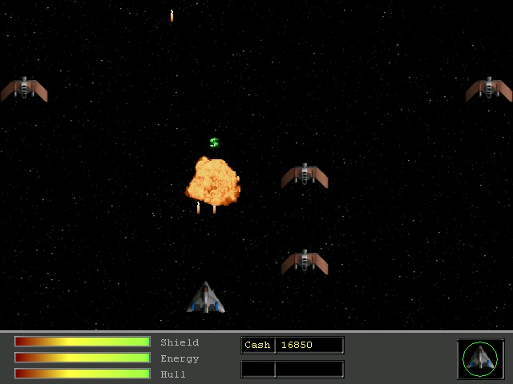



## Invasion Game \(VBRaptor\)

### Description

This is a game I've been working on off and on again for a little while now. It's a top down shooter done using DirectX.  The last upload had a quite a few bugs. This one I've corrected some of the obvious bugs such as the shots sometimes missed enemies despite hitting them. Enemies won't destroy eachother any longer when overlapping. Also I am pretty sure I fixed the bug where nothing appears occasionally when first starting a game. Comments and votes are welcome and appreciated. Thanks
 
### More Info
 

             |
---                |---
**Submitted On**   |2003-09-08 01:23:40
**By**             |[Stewart](https://github.com/Planet-Source-Code/PSCIndex/blob/master/ByAuthor/stewart.md)
**Level**          |Intermediate
**User Rating**    |4.6 (32 globes from 7 users)
**Compatibility**  |VB 5\.0, VB 6\.0
**Category**       |[Games](https://github.com/Planet-Source-Code/PSCIndex/blob/master/ByCategory/games__1-38.md)
**World**          |[Visual Basic](https://github.com/Planet-Source-Code/PSCIndex/blob/master/ByWorld/visual-basic.md)
**Archive File**   |[Invasion\_G192093842005\.zip](https://github.com/Planet-Source-Code/stewart-invasion-game-vbraptor__1-62074/archive/master.zip)

